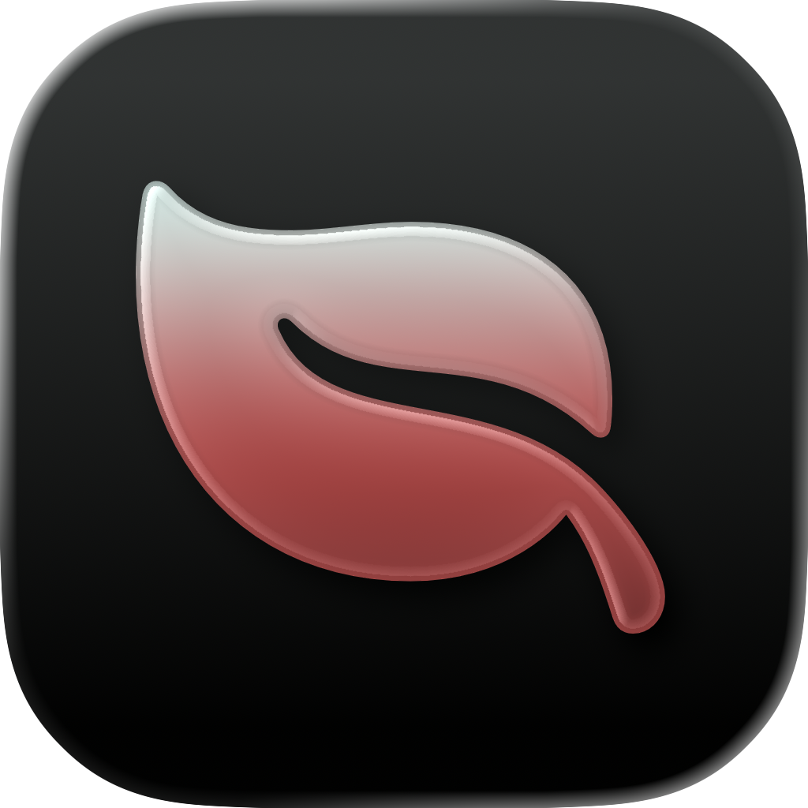

<div align="center">
  <pre>
╔════════════════════════════════════════════════════════╗
║  █████╗ ██████╗      ██╗ ██╗  ██╗ ███╗   ██╗  ██████╗  ║
║ ██╔══██╗██╔══██╗     ██║ ██║  ██║ ████╗  ██║ ██╔════╝  ║
║ ███████║██████╔╝     ██║ ███████║ ██╔██╗ ██║ ██║  ███╗ ║
║ ██╔══██║██╔══██╗██   ██║ ╚════██║ ██║╚██╗██║ ██║   ██║ ║
║ ██║  ██║██║  ██║╚█████╔╝      ██║ ██║ ╚████║ ╚██████╔╝ ║
║ ╚═╝  ╚═╝╚═╝  ╚═╝ ╚════╝       ╚═╝ ╚═╝  ╚═══╝  ╚═════╝  ║
╚════════════════════════════════════════════════════════╝
  </pre>

  <h1>BreakLoop</h1>
  
  <p><strong>Konsumkosten sichtbar machen. Gewohnheit brechen. Fortschritt belohnen.</strong></p>

  <p>
    
    
    
  </p>
</div>

## Kurzpitch

BreakLoop ist mein iOS Bootcamp Abschlussprojekt.

Die Idee: Nutzer:innen sehen klar, was ihr Konsum wirklich kostet, setzen sich Ziele und bleiben mit kleinen Rewards eher dran.

## Warum ich die App baue

Im Alltag wirken Konsumkosten oft „nicht so schlimm".
Wenn man die Zahlen aber auf Woche, Monat und Jahr sieht, ändert sich der Blick schnell.
Genau da setzt BreakLoop an.

## Was aktuell drin ist

<ul>
  <li><code>Dashboard</code> → Kostenüberblick + erste Insights</li>
  <li><code>Expenses</code> → Konsum und Purchase Einträge</li>
  <li><code>ConsumptionPlan</code> → Reduktionsziel oder Target Datum</li>
  <li><code>Rewards</code> → Meilensteine sichtbar machen</li>
  <li><code>Settings</code> → Preis und Basiswerte anpassen</li>
</ul>

## Tech und Struktur

- iOS + SwiftUI
- MVVM + Service Layer
- Feature first Struktur

```text
BreakLoop/
├── BreakLoop/
│   ├── App/
│   ├── Core/
│   ├── Shared/
│   ├── Features/
│   │   ├── Dashboard/
│   │   ├── Expenses/
│   │   ├── ConsumptionPlan/
│   │   ├── Rewards/
│   │   └── Settings/
│   └── Resources/
└── BreakLoopTests/
```

## Projektstatus

<table>
  <tr>
    <th align="left">Bereich</th>
    <th align="left">Status</th>
    <th align="left">Notiz</th>
  </tr>
  <tr>
    <td>Projektstruktur</td>
    <td>✅ Fertig</td>
    <td>Feature first Struktur steht</td>
  </tr>
  <tr>
    <td>Design System</td>
    <td>✅ Basis fertig</td>
    <td>Farben + Typografie angelegt</td>
  </tr>
  <tr>
    <td>Domain Modelle</td>
    <td>✅ Angelegt</td>
    <td>Profile, Entries, Goals vorhanden</td>
  </tr>
  <tr>
    <td>Expense Flow</td>
    <td>🟡 In Arbeit</td>
    <td>Nächster Fokus für echte Daten</td>
  </tr>
</table>

## Roadmap

<table>
  <tr>
    <th align="left">Phase</th>
    <th align="left">Status</th>
    <th align="left">Ziel</th>
  </tr>
  <tr>
    <td><strong>1 · Scaffold</strong></td>
    <td>✅ Fertig</td>
    <td>Grundstruktur, Module, Basis Design System</td>
  </tr>
  <tr>
    <td><strong>2 · Expense Tracking</strong></td>
    <td>🟡 Nächster Schritt</td>
    <td>Konsum und Purchase Eingabe + Kostenlogik</td>
  </tr>
  <tr>
    <td><strong>3 · Konsum Plan</strong></td>
    <td>⏳ Geplant</td>
    <td>Ziele setzen und Fortschritt tracken</td>
  </tr>
  <tr>
    <td><strong>4 · Rewards</strong></td>
    <td>⏳ Geplant</td>
    <td>Meilensteine und sichtbare Belohnung</td>
  </tr>
  <tr>
    <td><strong>5 · Insights und Polish</strong></td>
    <td>⏳ Geplant</td>
    <td>Bessere Auswertung, UX Feinschliff</td>
  </tr>
</table>

## Lokal starten

<ol>
  <li><code>BreakLoop/BreakLoop.xcodeproj</code> öffnen</li>
  <li>Scheme <code>BreakLoop</code> wählen</li>
  <li>Simulator oder Device wählen</li>
  <li><code>Cmd + R</code></li>
</ol>
